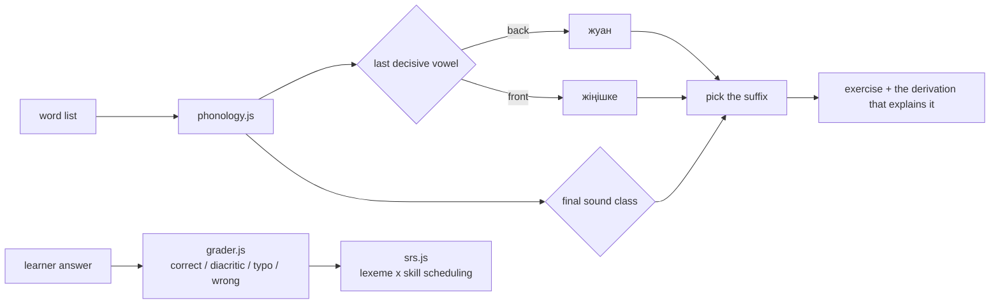

# Aralas — Kazakh, by the rule

[](https://github.com/Yerkhat1/aralas-oqu/actions/workflows/ci.yml)

A Kazakh learning app built around the one thing that makes Kazakh different from
every language Duolingo teaches well: **its morphology is algorithmic.**

Suffixes are chosen by two facts about the stem — the backness of its last decisive
vowel, and the voicing class of its final consonant. That means the app can *generate*
unlimited correct exercises from a bare word list, and — the part that matters — it can
explain every answer instead of just marking it red.

```
үй + барыс септік
  Vowel harmony : last vowel «ү» → front (жіңішке)
  Final sound   : «й» is р, й, у
  Suffix        : → −ге              үйге
```

No other Kazakh app shows that derivation. It is the product.

## Run it

```bash
python3 -m http.server 4321
```

Then open <http://localhost:4321>. No build step, no dependencies — the app is ES
modules and one stylesheet. In Claude Code the dev server is also registered in
`.claude/launch.json` as `aralas`.

```bash
node test/phonology.test.mjs
node --test test/unit/
```

64 assertions against attested forms from standard Kazakh grammar, plus 37 tests over the grader and the scheduler. Run this before
touching `phonology.js`; it is the file where a linguistic bug can hide silently.

## Layout

| File | What lives there |
|---|---|
| `src/js/phonology.js` | **The engine.** Vowel harmony, consonant classes, 13 suffix paradigms, lenition, derivation traces. All linguistic truth is here. |
| `src/js/lexicon.js` | Seed curriculum: 8 units × 10 lexemes, grammar concepts, contrastive notes. Shaped exactly like `db/schema.sql`. |
| `src/js/grader.js` | Answer checking with the four-tier verdict (correct / diacritic / typo / wrong). |
| `src/js/srs.js` | SM-2 with a learning ladder. Schedules **(lexeme × skill)** pairs, not words. |
| `src/js/session.js` | Session assembly, the recognise→produce→type ladder, in-session reinsertion. |
| `src/js/store.js` | Offline-first persistence + append-only outbox. Every method is named after the Supabase call that replaces it. |
| `src/js/i18n.js` | RU/EN interface strings, Cyrillic⇄Latin transliteration. |
| `src/js/app.js` | Four screens and the exercise loop. Plain DOM. |
| `db/schema.sql` | Postgres/Supabase schema, with the reasoning for the choice at the top. |

## The decisions worth knowing about

**Scheduling is per (word × skill).** Knowing `кітап` = book and knowing it pluralises
to `кітаптар` are separate memories. One shared "mastered" flag is the modelling
mistake that makes generic flashcard apps useless for Turkic languages.

**Missing Kazakh letters are accepted, then corrected.** Nine letters (ә ғ қ ң ө ұ ү һ і)
don't exist on a Russian or English keyboard, and most learners in Kazakhstan are on a
Russian layout. Typing `тосек` for `төсек` is graded `diacritic`: accepted, the missing
ө shown large and marked, and the card rescheduled sooner. Rejecting it outright reads
as a broken app; accepting it silently teaches the wrong spelling. There is also an
on-screen row for the nine letters.

**Kazakh is stored in Cyrillic only.** The 2021 Latin reform is still being amended;
storing a second script would mean migrating every row each time it changes. Latin is
generated at render time and answers are always graded against Cyrillic.

**No hearts, no lives.** Progress only moves forward. A missed item is re-queued 3–4
positions later, at most twice — uncapped reinsertion means a struggling learner can
never finish the session.

**Units gate on retention, not completion.** The next unit unlocks at 60% retained,
measured from scheduler state, not from screens viewed.

## Content sourcing

The okulyk.kz textbooks are **school textbooks under copyright.** Use them as a
reference for *curriculum sequence* — what topic order the Kazakh school system
actually uses — and author the sentences fresh. Do not scrape them.

Openly-licensed material that can be used directly:

| Source | Licence | Use |
|---|---|---|
| [Kazakh Universal Dependencies (KTB)](https://github.com/UniversalDependencies/UD_Kazakh-KTB) | CC BY-SA 4.0 | Morphologically annotated sentences; validates the suffix engine |
| [Apertium `apertium-kaz`](https://github.com/apertium/apertium-kaz) | GPL-3.0 | Full morphological analyser; the exception lists for loanword harmony |
| [Wiktionary (kk)](https://kk.wiktionary.org) | CC BY-SA 4.0 | Definitions, attribution required |
| [Tatoeba](https://tatoeba.org) | CC BY 2.0 FR | Example sentences with translations |
| [Common Voice kk](https://commonvoice.mozilla.org/kk) | CC0 | Native-speaker audio |

**Audio:** browsers ship no `kk-KZ` speech synthesis voice, so `speechSynthesis` is not
an option — it will silently fall back to Russian and mispronounce every Kazakh-specific
letter. Azure Speech has two neural `kk-KZ` voices (Aigul, Daulet); generate once,
store the MP3s in Supabase Storage, reference them from `lexeme.audio_path`.

## Not built yet

Named honestly, in the order they are worth doing:

1. **Audio.** Nothing speaks yet. Highest-value missing piece.
2. **Sentence-level exercises.** Word order (SOV) and the zero-copula contrast with
   Russian need full sentences, not single words.
3. **Supabase wiring.** `db/schema.sql` is written but not applied — the Supabase MCP
   connector in this session is unauthenticated. `store.js` is shaped for the swap.
4. **Placement test.** The existing Aralas code-switching classifier (`stemIsKazakh`)
   would slot in here: paste a paragraph, get placed.
5. **Verb conjugation.** Tense/aspect paradigms are the obvious next block in
   `phonology.js`; the table format already supports them.


## How an exercise is built



Two decisions in here are worth the reading time. `grader.js` folds the nine
Kazakh-only letters onto their Russian-keyboard neighbours, because most learners in
Kazakhstan type on a Russian layout; a missing «ә» is accepted, shown, and rescheduled
sooner rather than marked wrong. `srs.js` schedules a *lexeme by skill* pair rather than
a word, since knowing that «кітап» means book is a different memory from knowing it
pluralises to «кітаптар», and that second memory is where learners of an agglutinative
language actually fail.

## Limitations

- The lexicon is small. The generator is unlimited, the word list is not.
- Six cases and the plural are covered. Possessives and the verb system are not.
- Exercise generation is rule-based throughout. Irregular stems need a lexicon entry,
  and the rules do not know about them until one is added.
- No account system; progress lives in browser storage on one device.

## Next

- Possessive suffixes, which interact with case and are where the rules get interesting.
- A spoken-form check, since vowel harmony is audible before it is spellable.
